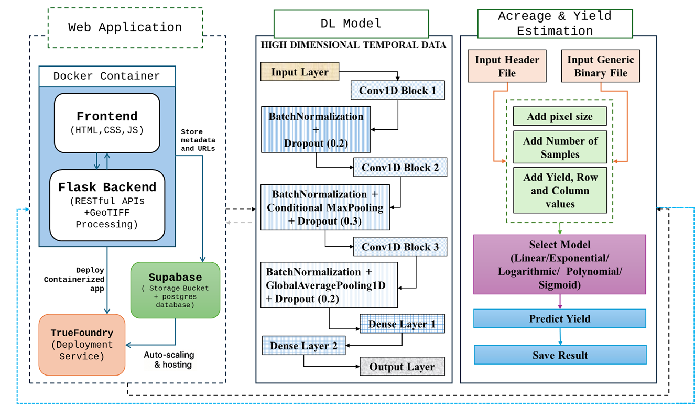

# MapMyCrop: Smart Acreage &amp; Yield Estimation

## Team 5B

## Parts:

### 1. [WebApp Description](#webapp-description)

### 2. [Java Acreage and Yield Estimation Tool](#java-tool-for-crop-acreage-and-yield-estimation)

### 3. [Deep Learning for Crop Acreage Mapping](#deep-learning-for-crop-acreage-mapping)

### Full architecture



# Webapp description

A web application built with Flask that allows users to upload `.tiff` satellite images, generates thumbnails, and stores image URLs to Supabase.

### deployed link in TrueFoundry

https://map-my-crop-ws-5b-1-8080.ml.iit-ropar.truefoundry.cloud/ <br>
(if link is not working, reload the site / open the link once again )

---

## 1. WebApp Features

- ✅ Upload `.tiff` satellite images
- ✅ Generate thumbnails using Rasterio
- ✅ Run deep learning inference with a trained model
- ✅ Convert inference output to `.png` and store to Supabase
- ✅ Save result URLs in PostgreSQL (via SQLAlchemy)
- ✅ Serve static files and results with Flask routes

---

## Web app Tech Stack

- **Backend:** Flask, SQLAlchemy, Supabase, Rasterio, NumPy
- **ML/Inference:** Keras, TensorFlow
- **Others:** Docker, dotenv, Pillow, GDAL
- **Frontend:** HTML, CSS, Leaflet.js , OpenStreetMaps

## Installation & Setup

### 1. Set Up Supabase Storage and Database

#### Create a Supabase Bucket (or any object or block storage )

1. Go to [https://app.supabase.com/](https://app.supabase.com/) and open your project.
2. Navigate to **Storage > Buckets**.
3. Click **"New bucket"** and enter a name
4. Make sure to check **"Public"** if you want direct access to uploaded files via URL.
5. Use this bucket name in your `.env` file:

---

#### Create a Relational Database

You can use **PostgreSQL**, **SQLite**, or any SQL-compatible database. Below are instructions :

##### PostgreSQL (Recommended)

1. Use a PostgreSQL service Supabase, Railway, Render, etc.
2. Create a new database called `geo_tiff`.
3. Copy the connection string (URL) and use it in your `.env`:

---

### 2. Install Requirements

```bash
pip install -r requirements.txt
```

---

### 3. Setup Environment Variables

Create a `.env` file in the `app` folder:

```env
SUPABASE_URL= https://your-project.supabase.co
SUPABASE_KEY= your-private-key
SUPABASE_BUCKET= your bucket name

DB_USER= your user id
DB_PASSWORD= database password
DB_HOST= host name from database
DB_NAME= postgres

```

---

### 5. Initialize the Database (First-Time Only)

In a Python shell, run the following to create the database tables:

```python
from app import db
db.create_all()
```

---

## Running the App

Run the Flask app with:

```bash
python app/app.py
```

The app will be accessible at `http://localhost:5000/`.

<hr><br>

# Java Acreage and Yield Estimation Tool

A standalone desktop application developed in **Java** for estimating agricultural acreage and yield based on user-supplied yield values and classified acreage data.

## Overview

This tool provides a simple and intuitive interface to:

- Input classified area image (in binary format) and header file
- Enter user-supplied yield per pixel values along with corresponding row and column values
- Estimate total acreage and yield based on the provided samples.
- View and save results

It is designed to assist in agricultural planning by processing structured input data to produce fast, offline acreage and yield calculations.

---

## Features

- Built with **Java Swing** and **AWT**
- Compatible with **binary input data** formats
- Simple input/output interface
- Fast and offline processing
- Platform-independent — runs on any machine with Java installed

---

## Getting Started

### Prerequisites

- **Java JDK 8 or higher**  
  Download: [Oracle Java](https://www.oracle.com/java/technologies/javase-downloads.html)

### Running the Tool

```bash
javac CropYieldGUI.java
java CropYieldGUI
```

<hr><br>

# Deep Learning for Crop Acreage Mapping

A **Python** application for training and applying a deep learning model to classify multispectral temporal remote sensing `.bil` format data. It leverages **1D Convolutional Neural Networks** tested on specific crops (like paddy , wheat , grean pea and moong pulses) based on temporal indices values.

## Overview

This tool allows users to:

- Read and process `.bil` + `.hdr` image files (ENVI format)
- Train a **1D CNN** model on labeled pixel data
- Automatically handle class imbalance and class weighting
- Predict and generate classification maps
- Saves results in binary, HDR, and annotated image formats
- Highlight areas of high model confidence

Designed for agricultural remote sensing applications like crop classification from temporal multispectral images.

## Features

- Fully offline tool — works on local data only
- Supports `.bil` + `.hdr` formats
- Dynamic model built based on input dimensions
- Class imbalance detection + weighted training
- Custom visualization using `matplotlib` + `PIL`
- Highlight target class (like paddy) with red mask
- Saves predicted maps and confidence overlays

---

## Requirements

Install dependencies with:

```bash
pip install -r requirements.txt
```

### Input Format

#### Required Files

- `.bil` file: Binary image data
- `.hdr` file: ENVI metadata that defines the image's rows, columns, and bands

These files must be paired — every `.bil` file must have a corresponding `.hdr` file with the same name.

## Run the Notebook

To test or run the model manually using Jupyter Notebook:

1. Make sure you have all dependencies installed (via `requirements.txt`)

2. Activate your virtual environment (if using one):

   ```bash
   source venv/bin/activate  # Windows: venv\Scripts\activate
   ```

3. Launch Jupyter Notebook:

   ```bash
   jupyter notebook
   ```

4. Open the desired `.ipynb` file (e.g., `predict_test_images.ipynb`)

5. Run all cells to process the `.bil` and `.hdr` files and generate predictions.
